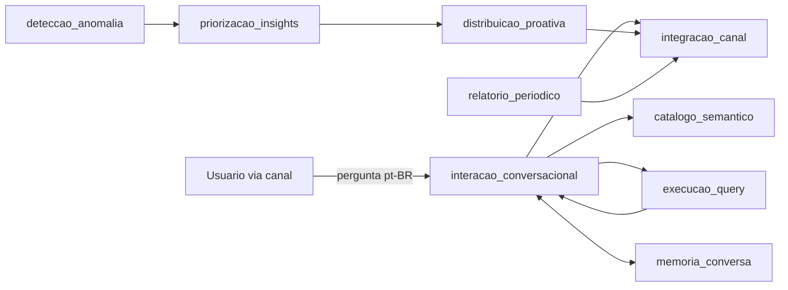

# Intelligence Agent

Agente de inteligencia de produto **governado**: responde perguntas de negocio em portugues brasileiro sobre metricas, detecta anomalias e distribui insights proativamente por canal de mensagem. Todo numero e calculado por codigo deterministico (nunca pelo LLM), toda resposta carrega proveniencia ou o sistema se abstem explicitamente, e nenhuma mensagem proativa sai sem canal e destinatario aprovados.

Projeto pessoal, original, com dominio de negocio generico/sintetico (metricas de um SaaS de exemplo). Construido do zero seguindo o fluxo do [engineering-playbook](https://github.com/fisaarpelesjo/engineering-playbook): PRD -> spec -> plan -> tasks -> implement -> verify -> checkpoint -> delivery.

PRD completo: `docs/requirements/project-requirements.md`. Constitution (5 principios nao-negociaveis): `.specify/memory/constitution.md`.

## Arquitetura

Pipeline de 9 pacotes Python independentes em `packages/`, cada um com fronteira de dependencia unidirecional:



| Pacote | Responsabilidade |
|---|---|
| `catalogo_semantico` | Decisao de autorizacao deny-by-default por metrica/dimensao; auditoria por decisao |
| `execucao_query` | Query read-only, estruturalmente restrita, sob teto de bytes/linhas |
| `interacao_conversacional` | Resolve pergunta pt-BR, vocabulario de periodo, comparacao, narrativa via LLM stub |
| `relatorio_periodico` | Relatorio diario de KPIs e avaliacao de alerta, sempre como saidas distintas |
| `deteccao_anomalia` | Candidate finding por desvio de baseline (media movel); nunca se auto-origina |
| `priorizacao_insights` | Ordena findings por tupla (impacto, alcance), nunca por score unico |
| `integracao_canal` | Identidade derivada por canal (nunca identificador bruto), matriz de capacidade |
| `distribuicao_proativa` | Gate: prioridade + canal habilitado + allow-list antes de originar mensagem |
| `memoria_conversa` | Memoria de turno de curto prazo; inbound estruturalmente desligado |

## Uso

```bash
uv sync
uv run pytest                              # 83 testes, todos os pacotes
uv run ruff check . && uv run ruff format --check .
uv run pyright
uv run engineering-playbook verify         # convergencia PRD/estado
uv run engineering-playbook doctor         # diagnostico de ambiente
```

Cada pacote roda isolado: `uv run pytest packages/<nome>`.

## Decisoes registradas (ADR)

`docs/decisions/`: canal real adiado (0001), catalogo sintetico (0002), cadencia diaria do relatorio (0003), observabilidade adiada (0004), LLM provider stub (0005), regra de baseline por media movel (0006, `Proposed`).

## Estado atual e debito conhecido

MVP funcional: todos os requisitos funcionais do PRD (FR-001..FR-015) implementados e testados nos 9 pacotes. PRD ainda em `status: draft` (sem aprovacao humana formal).

Debito conhecido, registrado em `docs/requirements/project-requirements.md` (secao Waiting room):

- **NFR-002** — rastreabilidade ponta a ponta: `correlation_id` ainda nao implementado.
- **NFR-003** — dedupe idempotente de entrega: outbox transacional e fingerprint ainda nao implementados.
- **NFR-006** — fronteira de pacote garantida por teste estatico generico: existe so um teste AST especifico em `deteccao_anomalia` (FR-005), nao um gate de fronteira por pacote.

Canal real e LLM provider real seguem adiados (fake/stub) ate decisao explicita de sair do MVP.
