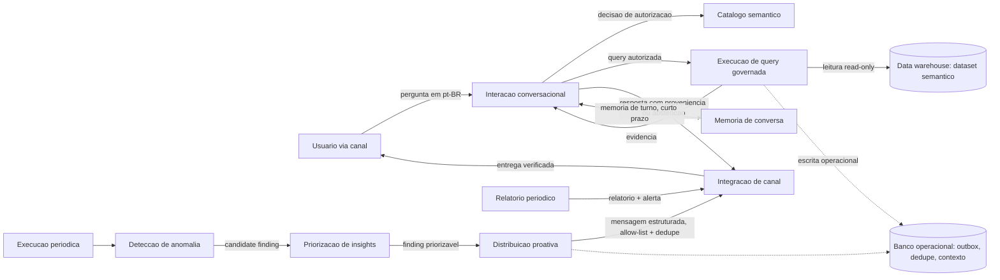

# Project Requirements Document — PRD

<!--
Modelo mestre de requisitos do produto antes do GitHub Spec Kit.
Use N/A - nao aplicavel, porque: <justificativa> quando uma secao nao se aplicar.
Nao remova secoes sem registrar por que elas nao se aplicam.
Nenhum agente pode marcar este documento como approved nem inventar aprovacao humana.
-->

## Instrucoes de uso

Este PRD e a fonte mestre de requisitos do produto Intelligence Agent: um projeto pessoal, original e independente, construido do zero seguindo o fluxo canonico do engineering-playbook (PRD -> spec -> plan -> tasks -> implement -> verify -> checkpoint -> delivery). Nao e derivado, copiado nem reconstruido a partir de codigo, dado de negocio ou decisao interna de nenhum produto de terceiros — o padrao arquitetural (agente de analytics governado, com etapas de catalogo semantico, execucao de query, interacao, deteccao de anomalia e distribuicao proativa) e um padrao de engenharia de agentes de IA amplamente discutido no mercado, aplicado aqui a um dominio de negocio generico/sintetico definido para este projeto.

Preencha novas secoes usando `TODO`, `ASSUMPTION` ou `QUESTION` para informacoes ausentes. Nao invente aprovacao humana nem stakeholders reais.

Perfil adotado: **standard** (todas as secoes aplicaveis, requisitos atomicos, NFRs mensuraveis, rastreabilidade, riscos, estrategia de validacao e aprovacao humana antes da implementacao).

## Metadados e controle do documento

Status atual: draft. Nenhuma aprovacao humana ainda ocorreu. `owners` reflete o autor/mantenedor deste projeto pessoal; papeis formais (reviewer/approver) ficam `QUESTION` ate decisao explicita.

## Historico de alteracoes

| Data | Versao | Autor | Mudanca | Impacto |
|---|---|---|---|---|
| 2026-09-07 | 0.1.0 | Agente (Claude, sessao com Filipe Sales Araujo) | Rascunho inicial do PRD para o projeto Intelligence Agent | Baseline de requisitos para iniciar a reconstrucao seguindo o fluxo canonico do playbook |
| 2026-09-07 | 0.2.0 | Agente (Claude, sessao com Filipe Sales Araujo) | Reescrita para remover qualquer referencia, citacao ou dado especifico de um produto de terceiros; o documento passa a descrever um produto original com dominio de negocio generico/sintetico | Elimina risco de propriedade intelectual de terceiros no PRD; nao muda a arquitetura pretendida |
| 2026-09-07 | 0.3.0 | Agente (Claude, sessao com Filipe Sales Araujo) | Resolvidas as decisoes ADR-0001 a ADR-0005 (canal/LLM/observabilidade adiados com fake/stub; cadencia diaria do relatorio; catalogo sintetico) apos decisao explicita do autor | Destrava a spec `003-interacao-conversacional`; recortes `001` e `002` ja implementados e convergidos |

## Aprovacoes

| Pessoa | Papel | Data | Decisao | Observacoes |
|---|---|---|---|---|
| QUESTION | Product owner | QUESTION | pendente | Nenhuma aprovacao humana registrada; obrigatoria antes de `specify`/`plan`/`tasks` para qualquer recorte deste PRD, conforme ENGINEERING.md |

## Resumo executivo

Intelligence Agent e um agente de inteligencia de produto **governado**: responde perguntas de negocio em portugues brasileiro sobre metricas de um produto digital, detecta anomalias nessas metricas e distribui insights proativamente por canais de mensagem. O diferencial central nao e a capacidade conversacional — e a governanca: toda resposta numerica e calculada por codigo deterministico (nunca pelo LLM), toda resposta carrega proveniencia ou o sistema se abstem explicitamente, e toda mensagem proativa exige aprovacao de canal e destinatario antes de sair. O LLM e usado apenas para interpretar a pergunta e narrar o resultado ja calculado — nunca para fazer contas ou afirmar causalidade.

O produto e construido como um pipeline de pacotes Python independentes (catalogo semantico -> execucao de query governada -> interacao conversacional/integracao de canal -> deteccao de anomalia -> priorizacao de insights -> distribuicao proativa -> relatorio periodico -> memoria de conversa), cada um com fronteira de dependencia unidirecional garantida por teste automatizado, e camadas de governanca declarativa (politicas de canal, de interpretacao, de query e de relatorio) que operam **fail-closed por padrao**: enquanto uma politica nao for aprovada por decisao humana registrada, a capacidade correspondente fica bloqueada, nao permissiva.

Este e um projeto pessoal construido do zero. O dominio de negocio usado como exemplo ao longo deste documento (metricas de um produto SaaS generico: aquisicao, receita recorrente, retencao) e ilustrativo e sintetico, escolhido apenas para dar concretude aos requisitos — nao representa nenhuma empresa ou produto real.

## Problema ou oportunidade

Decisoes de produto e negocio tipicamente dependem de alguem com acesso e conhecimento tecnico consultar um data warehouse diretamente, interpretar os numeros corretamente (considerando janelas comparaveis, metricas depreciadas, cobertura de dados) e comunicar isso de forma confiavel. Isso e lento, concentra conhecimento em poucas pessoas, e cria risco real de erro de interpretacao (comparar periodo parcial com periodo completo, usar metrica errada, ignorar uma anomalia ate ela virar problema visivel).

A oportunidade e um agente que democratiza o acesso a essas respostas em linguagem natural, sem abrir mao de rigor: cada numero que ele apresenta e auditavel ate a fonte, cada comparacao segue regras explicitas, e ele avisa proativamente quando algo foge do padrao — ao inves de esperar alguem perguntar.

## Evidencias do problema

- ASSUMPTION: equipes de produto/dados tipicamente gastam tempo significativo respondendo perguntas ad-hoc sobre metricas que poderiam ser respondidas por um agente confiavel — hipotese de partida deste projeto, a validar com uso real.
- ASSUMPTION: agentes de IA que calculam numeros via LLM (em vez de codigo deterministico) sao uma fonte conhecida de erro silencioso na industria — motiva o Principio "Deterministic First" deste produto.
- FACT: este e um projeto novo, sem uso em producao ainda; nao ha metricas historicas proprias de erro/incidente a citar — serao coletadas apos a primeira implantacao.

## Visao do produto

Um agente que qualquer pessoa autorizada pode perguntar, em portugues natural, sobre o desempenho de um produto digital, e receber uma resposta correta, com evidencia rastreavel, dentro dos limites do que os dados realmente sustentam — inclusive quando a resposta correta e "nao sei responder isso com confianca". O mesmo agente observa as metricas continuamente e avisa, sem ser perguntado, quando algo relevante muda fora do padrao esperado, atraves do canal certo, para a pessoa certa, sem duplicar nem inundar ninguem de mensagens.

## Proposta de valor

- Para quem pergunta: resposta em linguagem natural, mais rapida que abrir um dashboard ou pedir para alguem rodar uma query, com o mesmo rigor de uma analise manual cuidadosa.
- Para quem seria notificado: descoberta proativa de anomalias antes que virem problema visivel, sem ruido (rate limit, dedupe, allow-list de destinatario).
- Para a organizacao que adotar o produto: um unico ponto de verdade governado para metricas — impossivel de contornar com SQL livre ou acesso direto a dados brutos — reduzindo risco de decisao baseada em numero errado ou mal-interpretado.

## Objetivos

- SC-001: Toda resposta do agente contem proveniencia auditavel ou abstencao explicita com motivo — nunca um numero sem origem rastreavel.
- SC-002: Nenhuma mensagem proativa duplicada chega a um destinatario.
- SC-003: Todo o codigo que roda em producao esta versionado neste repositorio, desde o primeiro commit deste projeto.
- SC-004: Todos os workflows de CI executam de forma bloqueante, sem excecao.
- SC-005: Nenhum segredo (chave de servico, token, credencial) e commitado no historico git, de forma continua e verificavel.

## Metricas e criterios de sucesso

| ID | Metrica | Unidade | Baseline | Alvo | Metodo | Evidencia |
|---|---|---|---|---|---|---|
| SC-001 | Respostas com proveniencia ou abstencao explicita | % das respostas | 0% (projeto novo, sem medicao ainda) | 100% | test | Suite de testes do pacote de interacao conversacional |
| SC-002 | Mensagens proativas duplicadas entregues | contagem por periodo | N/A (sem operacao ainda) | 0 | test | Testes de dedupe por fingerprint no pacote de distribuicao proativa |
| SC-003 | Codigo em producao versionado neste repositorio | % do codigo que roda em producao | N/A (sem producao ainda) | 100% | inspection | Inventario de deploy comparado ao conteudo do repositorio |
| SC-004 | Workflows de CI executados sem skip | % dos workflows definidos | N/A (CI ainda a definir) | 100% | inspection | Historico de execucoes do GitHub Actions |
| SC-005 | Segredos commitados no historico git | contagem | 0 (repositorio novo) | 0 | analysis | `tools/git-hooks/pre-push` (a criar) + scanner de segredos do `engineering-playbook delivery commit` |

## Nao objetivos

O produto explicitamente nao tenta: substituir ferramentas de BI existentes; permitir SQL livre ou acesso a dados brutos/staging fora do dataset governado; operar como sistema multi-agente; fazer RAG sobre linhas de fato; afirmar causalidade de forma autonoma (toda claim causal exige avaliacao humana); rodar LLM self-hosted; operar em Kubernetes ou usar Kafka no MVP.

## Itens fora de escopo

- Interface de usuario grafica (o produto e conversacional, via canal de mensagem).
- Suporte a idiomas alem de portugues brasileiro no MVP.
- Onboarding self-service de novas metricas pelo usuario final (cadastro de metrica e fluxo governado, nao autoatendido).
- Recebimento de mensagens inbound no pacote de memoria de conversa, ate decisao explicita habilitar esse fluxo.

## Stakeholders

| Stakeholder | Papel | Interesse | Fonte |
|---|---|---|---|
| Filipe Sales Araujo | Autor e product owner do projeto | Definir escopo, aprovar politicas de governanca, priorizar recortes | Autor deste PRD |
| QUESTION | Usuarios finais que perguntam ao agente | Respostas rapidas e confiaveis sobre metricas de negocio | Persona a validar quando houver usuarios reais |
| QUESTION | Destinatarios de alerta proativo | Ser avisado de anomalia relevante sem ruido | Persona a validar quando houver usuarios reais |

## Usuarios e personas

QUESTION: nenhuma persona real foi validada ainda (projeto novo). ASSUMPTION de partida: (1) um "consultor de metricas" que pergunta ao agente em vez de escrever SQL; (2) um "destinatario de alerta" que recebe notificacoes proativas via canal de mensagem e precisa confiar no conteudo sem verificar a fonte manualmente. Ambas devem ser validadas com uso real antes de decisoes de produto materiais.

## Necessidades dos stakeholders

| ID | Stakeholder | Necessidade | Evidencia | Requisitos relacionados |
|---|---|---|---|---|
| NEED-001 | Product owner | Aprovar explicitamente cada politica de governanca antes dela liberar uma capacidade | Decisao de design deste projeto (padrao fail-closed) | BR-001, BR-005, FR-001, FR-013 |
| NEED-002 | Usuario final | Obter resposta confiavel em linguagem natural sem precisar saber SQL | Objetivo de produto (Visao do produto) | FR-003, FR-011, FR-012 |
| NEED-003 | Destinatario de alerta | Nao ser inundado de mensagens duplicadas ou nao autorizadas | Objetivo de produto (Proposta de valor) | FR-007, NFR-003, CON-004 |
| NEED-004 | Product owner / auditoria | Rastrear toda decisao de acesso a dado ate um evento auditavel | Requisito de governanca deste projeto | FR-015, NFR-002 |

## Responsabilidades e ownership

O autor (Filipe Sales Araujo) e responsavel por todas as decisoes de produto, aprovacao de politica de governanca e operacao ate que outros papeis sejam definidos. QUESTION: ownership tecnico por pacote ainda nao formalizado (projeto individual no momento).

## Contexto e situacao atual

Este e um projeto novo, iniciado do zero. Nao existe implementacao anterior, dado de producao ou decisao de negocio previa a herdar — este PRD e o primeiro artefato do projeto. A arquitetura proposta (pipeline de pacotes independentes com fronteiras testadas e governanca declarativa fail-closed) reflete boas praticas gerais de engenharia de agentes de IA que tratam dados sensiveis e emitem comunicacao autonoma, nao uma migracao ou reconstrucao de sistema existente.

## Sistemas e processos relacionados

- **Data warehouse** (ex.: BigQuery ou equivalente): unica superficie de leitura permitida ao runtime do agente, restrita a um dataset/camada "semantica" curada; leitura direta de camadas brutas e proibida por constitution (Principio I).
- **Banco operacional** (ex.: Postgres): armazenamento operacional do agente (outbox transacional, memoria de conversa, estado de dedupe/cooldown); unico destino de escrita do agente.
- **Canal de mensagem** (ex.: Telegram, WhatsApp, Slack — a definir o primeiro canal real na implementacao): distribuicao proativa e interacao conversacional.
- **LLM Provider** (abstraido via interface `LLMProvider` com fallback): usado apenas para interpretar pergunta e narrar resultado ja calculado; nunca para calculo ou decisao de autorizacao.
- **CI** (GitHub Actions): gates bloqueantes de qualidade, a definir por pacote.

## Escopo e fronteiras do produto

Dentro do escopo: pipeline completo de pergunta-resposta governada sobre metricas de negocio; deteccao e priorizacao de anomalias; distribuicao proativa multicanal (comecando por um canal a definir); relatorio periodico de KPIs com alerta por regra; memoria de conversa de curto prazo.

Fora da fronteira do sistema de interesse, mas interagindo com ele: o data warehouse (fonte de dados, nao modificado pelo agente), o(s) canal(is) de mensagem externos (autenticidade do canal nunca e autoridade), e o LLM provider externo (chamado, nunca hospedado).

## Diagrama de contexto



## Glossario e linguagem do dominio

| Termo | Definicao | Fonte |
|---|---|---|
| Dataset semantico | Unica superficie de leitura permitida ao runtime do agente no data warehouse; substitui acesso direto a camadas brutas | Constitution deste projeto, Principio I |
| Candidate finding | Movimento medido de uma metrica frente a uma baseline, sob uma regra, sem afirmacao de causa | Design deste projeto |
| Claim class | Classificacao obrigatoria de toda afirmacao narrada: FACTUAL_RESULT, CALCULATED_COMPARISON, INTERPRETATION, LIMITATION | Design deste projeto |
| Fail-closed | Padrao de governanca em que, na ausencia de politica aprovada, a capacidade correspondente fica bloqueada, nunca permissiva por omissao | Constitution deste projeto |
| Registry ref | Identificador de identidade derivado, nunca o telefone/chat-id bruto do canal | Design deste projeto |
| Snapshot mark | Marca indicando que uma metrica de nivel (ex.: MRR, MAU) reflete o ultimo dia disponivel, nao um acumulado do periodo | Design deste projeto |

## Premissas

- ASSUMPTION: o primeiro canal de distribuicao real sera escolhido durante a spec do pacote de integracao de canal (Telegram e um candidato razoavel por simplicidade de API, mas nao esta decidido).
- ASSUMPTION: a stack tecnica (Python >=3.12, um data warehouse tipo BigQuery, Postgres operacional) e adequada para o MVP; LangGraph ou equivalente para orquestracao nao esta fixado.
- ASSUMPTION: o dominio de negocio de exemplo (metricas de produto SaaS: aquisicao, receita, retencao) e suficiente para especificar e testar o catalogo semantico sem depender de dado real de nenhuma empresa.

## Dependencias

- Tecnica: acesso a um projeto de data warehouse com um dataset "semantico" a popular (com dado sintetico/de exemplo neste projeto).
- Tecnica: um banco Postgres operacional.
- Tecnica: credenciais de um LLM provider (via interface abstrata `LLMProvider`).
- Tecnica: credenciais do canal de mensagem escolhido (a definir).
- Organizacional: decisao do product owner (autor) para aprovar cada politica de governanca antes dela liberar uma capacidade (fail-closed por design).
- Ferramental: engineering-playbook, do qual este repositorio depende via `pyproject.toml`, para o fluxo PRD -> spec -> plan -> tasks -> implement -> verify -> checkpoint -> delivery.

## Restricoes

```yaml
id: CON-001
title: "Acesso a dado de negocio somente leitura via dataset semantico"
type: CON
statement: "O sistema nao deve ler camadas brutas do data warehouse, nem executar SQL livre; toda leitura de dado de negocio deve passar pelo contrato AnalyticsQuery contra um dataset semantico curado."
rationale: "Garante que toda leitura seja governada, auditavel e restrita a metricas/dimensoes/operadores aprovados."
source: "Constitution deste projeto (Principio I: Governed Semantic Access)"
priority: must
status: proposed
acceptance_criteria:
  - id: AC-001
    statement: "Dado qualquer caminho de execucao do agente, quando uma query e emitida, entao ela referencia exclusivamente o dataset semantico e nunca uma camada bruta."
    verification_method: test
verification_method: test
dependencies: []
conflicts: []
related_items:
  - NEED-001
owner: "Filipe Sales Araujo"
risk: "Alto - violacao expoe dado nao governado; mitigado por allowlist estrutural na execucao de query."
```

```yaml
id: CON-002
title: "Stack tecnica fixa para o MVP"
type: CON
statement: "O sistema deve rodar em Python 3.12 ou superior, usar um data warehouse como fonte de leitura e Postgres como armazenamento operacional, e nao deve depender de Kubernetes, Kafka ou LLM self-hosted no MVP."
rationale: "Reduz superficie operacional e mantem o MVP focado; tecnologias fora dessa lista exigem justificativa e decisao registrada."
source: "Constitution deste projeto"
priority: must
status: proposed
acceptance_criteria:
  - id: AC-002
    statement: "Dado o pyproject.toml e a infraestrutura declarada, quando revisados, entao nenhuma dependencia de Kubernetes, Kafka ou LLM self-hosted esta presente sem uma excecao aprovada."
    verification_method: inspection
verification_method: inspection
dependencies: []
conflicts: []
related_items: []
owner: "Filipe Sales Araujo"
risk: "Baixo - constraint e negativa (proibicao), facil de verificar por inspecao de dependencias."
```

```yaml
id: CON-003
title: "LLM Provider abstraido"
type: CON
statement: "O sistema deve acessar qualquer provedor de LLM exclusivamente atraves de uma interface abstrata LLMProvider com suporte a fallback, nunca por chamada direta a um SDK especifico de fornecedor no codigo de dominio."
rationale: "Evita lock-in de fornecedor e permite trocar/adicionar provedores sem reescrever logica de dominio."
source: "Constitution deste projeto"
priority: should
status: proposed
acceptance_criteria:
  - id: AC-003
    statement: "Dado o codigo de dominio (fora da camada de infraestrutura), quando buscado por imports de SDK de LLM especifico, entao nenhum e encontrado fora da implementacao de LLMProvider."
    verification_method: inspection
verification_method: inspection
dependencies: []
conflicts: []
related_items: []
owner: "Filipe Sales Araujo"
risk: "Medio - acoplamento a um fornecedor especifico dificultaria troca futura."
```

## Jornadas dos usuarios

1. **Consulta direta**: usuario envia uma pergunta em portugues pelo canal -> integracao de canal verifica identidade -> interacao conversacional resolve a pergunta contra o vocabulario governado -> catalogo semantico autoriza ou nega -> se autorizado, execucao de query retorna evidencia -> resposta com proveniencia (ou abstencao) -> entrega pelo canal.
2. **Alerta proativo de anomalia**: execucao periodica roda deteccao de anomalia -> gera candidate finding -> priorizacao de insights classifica prioridade -> se priorizavel e canal/destinatario aprovados, distribuicao proativa monta mensagem estruturada -> entrega via canal.
3. **Relatorio periodico**: geracao de relatorio roda em horario definido -> monta o relatorio de KPIs e avalia a regra de alerta -> entrega via canal.

## Casos de uso e cenarios

- **Ator**: usuario autorizado. **Objetivo**: saber a variacao de uma metrica no ultimo mes. **Pre-condicoes**: metrica existe no catalogo e esta aprovada; usuario tem identidade valida no canal. **Fluxo**: pergunta -> autorizacao -> query -> resposta com proveniencia. **Resultado observavel**: resposta textual com valor, unidade, janela, fonte e data-as-of, OU abstencao explicita com motivo.
- **Ator**: sistema (execucao periodica). **Objetivo**: detectar e comunicar uma anomalia relevante sem intervencao humana. **Pre-condicoes**: baseline e regra de deteccao definidas; canal e destinatario aprovados. **Fluxo**: deteccao -> priorizacao -> gate de distribuicao -> entrega. **Resultado observavel**: mensagem estruturada de campos rotulados entregue uma unica vez ao destinatario correto, OU nenhuma mensagem se o finding nao for priorizavel.
- **Ator**: usuario autorizado. **Objetivo**: comparar dois periodos. **Pre-condicoes**: formula de comparacao aprovada existe. **Fluxo**: pergunta de comparacao -> validacao de janela comparavel -> se um dos periodos for parcial e o outro completo, recusa explicita citando a regra. **Resultado observavel**: resposta com o resultado OU recusa explicita com a regra violada nomeada.

## Fluxos principais

Pergunta em linguagem natural -> resolucao contra vocabulario governado -> decisao de autorizacao -> execucao read-only sob teto de custo -> montagem de resposta com proveniencia -> entrega verificada pelo canal.

## Fluxos alternativos

- Pergunta ambigua: sistema solicita clarificacao estruturada em vez de assumir interpretacao.
- Pergunta sobre metrica depreciada: sistema resolve a definicao historica correta (fechada, com data de vigencia) em vez de aplicar a definicao atual.
- Comparacao entre periodo parcial e periodo completo: sistema recusa a comparacao citando a regra de janela comparavel.

## Fluxos de erro e recuperacao

- Dado insuficiente ou cobertura abaixo do limiar: sistema abstem com motivo nomeado (nunca extrapola ou aproxima silenciosamente).
- Politica de governanca vazia/nao aprovada (fail-closed): sistema recusa a capacidade dependente com codigo de recusa nomeado, nunca falha silenciosamente nem degrada para um comportamento permissivo.
- Falha de entrega em um canal: mensagem permanece no outbox transacional ate confirmacao; reentrega e idempotente (dedupe por fingerprint evita duplicata quando a falha era so de confirmacao, nao de entrega real).

## Regras de negocio

```yaml
id: BR-001
title: "Autorizacao de acesso semantico deny-by-default"
type: BR
statement: "O sistema deve negar qualquer pergunta cuja metrica, dimensao ou combinacao nao esteja explicitamente aprovada no catalogo semantico, mesmo quando os dados subjacentes existem."
rationale: "Fail-closed e o padrao de seguranca central do produto: ausencia de aprovacao explicita nunca deve ser interpretada como permissao implicita."
source: "Constitution deste projeto (Principio I)"
priority: must
status: proposed
acceptance_criteria:
  - id: AC-004
    statement: "Dado um catalogo de politicas vazio ou sem entrada para uma metrica, quando essa metrica e solicitada, entao o sistema recusa com um codigo de motivo nomeado."
    verification_method: test
verification_method: test
dependencies: []
conflicts: []
related_items:
  - NEED-001
legal_or_policy_reference: "N/A"
evidence: "A produzir nos testes do pacote de catalogo semantico"
```

```yaml
id: BR-002
title: "Calculo deterministico, narrativa via LLM"
type: BR
statement: "O sistema deve calcular todo numero, comparacao e deteccao de anomalia por codigo deterministico; o LLM deve ser usado somente para interpretar a pergunta e narrar um resultado ja calculado, nunca para produzir ou ajustar um valor numerico."
rationale: "Elimina a classe de erro mais grave de agentes baseados em LLM: numero errado apresentado com confianca alta."
source: "Constitution deste projeto (Principio II: Deterministic First, Narrative Second)"
priority: must
status: proposed
acceptance_criteria:
  - id: AC-005
    statement: "Dado qualquer resposta numerica do agente, quando sua origem e inspecionada, entao o valor foi produzido por um modulo de calculo deterministico testado, nao por geracao do LLM."
    verification_method: inspection
verification_method: inspection
dependencies: []
conflicts: []
related_items:
  - NEED-002
legal_or_policy_reference: "N/A"
evidence: "A produzir nos testes do pacote de interacao conversacional"
```

```yaml
id: BR-003
title: "Proveniencia ou abstencao"
type: BR
statement: "O sistema deve incluir em toda resposta a proveniencia (fontes, data-as-of, cobertura, limitacoes) ou, quando o dado for insuficiente, deve se abster explicitamente com motivo nomeado, nunca apresentar um numero sem origem rastreavel."
rationale: "Sustenta confianca auditavel na resposta; abstencao explicita e preferivel a uma resposta plausivel porem nao sustentada pelos dados."
source: "Constitution deste projeto (Principio III: Provenance or Abstention)"
priority: must
status: proposed
acceptance_criteria:
  - id: AC-006
    statement: "Dada qualquer resposta emitida pelo sistema, quando seus campos sao inspecionados, entao ela contem um bloco de proveniencia preenchido ou um motivo de abstencao nomeado, nunca nenhum dos dois."
    verification_method: test
verification_method: test
dependencies: []
conflicts: []
related_items:
  - NEED-002
  - NEED-004
legal_or_policy_reference: "N/A"
evidence: "A produzir nos testes do pacote de interacao conversacional"
```

```yaml
id: BR-004
title: "Janela comparavel obrigatoria"
type: BR
statement: "O sistema nao deve comparar um periodo parcial com um periodo completo; comparacoes entre dois periodos parciais equivalentes sao permitidas."
rationale: "Comparar parcial com completo produz uma conclusao de tendencia estatisticamente enganosa."
source: "Constitution deste projeto (Principio III)"
priority: must
status: proposed
acceptance_criteria:
  - id: AC-007
    statement: "Dado um pedido de comparacao entre um periodo completo e um periodo em andamento, quando processado, entao o sistema recusa e nomeia a regra de janela comparavel violada."
    verification_method: test
verification_method: test
dependencies:
  - BR-003
conflicts: []
related_items: []
legal_or_policy_reference: "N/A"
evidence: "A produzir nos testes do pacote de interacao conversacional"
```

```yaml
id: BR-005
title: "Nenhuma claim causal autonoma"
type: BR
statement: "O sistema nao deve afirmar relacao de causa e efeito de forma autonoma; toda observacao de anomalia ou correlacao deve ser comunicada como correlacao, associacao ou hipotese, com aviso explicito, nunca como causa confirmada."
rationale: "Causalidade exige desenho experimental ou julgamento humano que o sistema nao possui; afirmar causa incorretamente e o tipo de erro mais caro para a credibilidade do produto."
source: "Constitution deste projeto (Principio II)"
priority: must
status: proposed
acceptance_criteria:
  - id: AC-008
    statement: "Dado um candidate finding de anomalia, quando narrado, entao sua claim_class e uma de FACTUAL_RESULT, CALCULATED_COMPARISON, INTERPRETATION ou LIMITATION, e nenhuma narrativa usa linguagem causal direta sem qualificador de hipotese."
    verification_method: test
verification_method: test
dependencies: []
conflicts: []
related_items: []
legal_or_policy_reference: "N/A"
evidence: "A produzir nos testes do pacote de deteccao de anomalia"
```

## Requisitos funcionais

Padroes de redacao equivalentes ao EARS.

```yaml
id: FR-001
title: "Decisao de autorizacao do catalogo semantico"
type: FR
statement: "Quando o sistema recebe uma pergunta mapeada para uma metrica/dimensao/formato de query candidato, o sistema deve retornar uma decisao de autorizacao (permitir ou negar com motivo) sem executar nenhuma leitura de dado."
rationale: "Separa a decisao de autorizacao da execucao, permitindo auditar e testar a governanca sem custo de query."
source: "Design deste projeto — pacote de catalogo semantico"
priority: must
status: proposed
acceptance_criteria:
  - id: AC-009
    statement: "Dada uma pergunta candidata, quando avaliada pelo catalogo semantico, entao uma decisao de autorizacao e retornada e nenhuma chamada ao data warehouse ocorre nesse passo."
    verification_method: test
verification_method: test
dependencies: []
conflicts: []
related_items:
  - NEED-001
owner: "Filipe Sales Araujo"
risk: "Baixo - decisao pura, sem efeito colateral"
target_release: "MVP"
stability: "draft"
```

```yaml
id: FR-002
title: "Execucao de query governada"
type: FR
statement: "Quando uma decisao de autorizacao permite uma pergunta, o sistema deve compilar e executar uma query estruturalmente restrita, somente leitura, contra o dataset semantico, sob tetos de bytes, linhas e tempo, e deve recusar a execucao quando nenhuma source publicavel, leitura de observacao ou politica de query aprovada existir."
rationale: "Garante que a unica forma de ler dado seja atraves de um caminho auditavel e limitado em custo."
source: "Design deste projeto — pacote de execucao de query"
priority: must
status: proposed
acceptance_criteria:
  - id: AC-010
    statement: "Dada uma decisao autorizada sem politica de query aprovada para o caso, quando a execucao e tentada, entao o sistema recusa com um dos motivos fail-closed nomeados."
    verification_method: test
verification_method: test
dependencies:
  - FR-001
conflicts: []
related_items: []
owner: "Filipe Sales Araujo"
risk: "Alto - e o unico ponto de leitura real de dado de negocio"
target_release: "MVP"
stability: "draft"
```

```yaml
id: FR-003
title: "Interacao em linguagem natural pt-BR"
type: FR
statement: "Quando um usuario envia uma pergunta em portugues brasileiro, o sistema deve resolve-la contra o vocabulario governado, montar a query autorizada correspondente, e retornar uma resposta com evidencia, uma recusa nomeada ou um pedido de clarificacao — sem manter estado entre turnos nesta camada."
rationale: "E a porta de entrada conversacional do produto; precisa ser previsivel e sem estado escondido."
source: "Design deste projeto — pacote de interacao conversacional"
priority: must
status: proposed
acceptance_criteria:
  - id: AC-011
    statement: "Dada uma pergunta ambigua, quando processada, entao o sistema retorna um pedido de clarificacao estruturado em vez de assumir uma interpretacao."
    verification_method: test
verification_method: test
dependencies:
  - FR-001
  - FR-002
conflicts: []
related_items:
  - NEED-002
owner: "Filipe Sales Araujo"
risk: "Medio - primeira fase, escopo de interacao ainda simples"
target_release: "MVP"
stability: "draft"
```

```yaml
id: FR-004
title: "Fronteira de identidade e transporte por canal"
type: FR
statement: "Quando uma mensagem chega ou sai por um canal externo, o sistema deve verificar a identidade do remetente via um identificador derivado (nunca o identificador bruto do canal) e aplicar a matriz de capacidade de renderizacao do canal, sem nunca tratar o canal como autoridade de identidade ou permissao."
rationale: "Canais externos sao substituiveis e nao confiaveis como fonte de identidade; a autoridade fica no sistema."
source: "Design deste projeto — pacote de integracao de canal"
priority: must
status: proposed
acceptance_criteria:
  - id: AC-012
    statement: "Dado um payload recebido de um canal, quando processado, entao nenhum campo de identidade bruta do canal (telefone, chat-id) e persistido fora do proprio limite do canal; apenas o identificador derivado e usado internamente."
    verification_method: test
verification_method: test
dependencies: []
conflicts: []
related_items:
  - NEED-003
owner: "Filipe Sales Araujo"
risk: "Alto - fronteira de seguranca entre externo e interno"
target_release: "MVP"
stability: "draft"
```

```yaml
id: FR-005
title: "Geracao de candidate finding de anomalia"
type: FR
statement: "Quando uma metrica monitorada se move em relacao a sua baseline sob uma regra definida, o sistema deve produzir um candidate finding contendo o movimento medido, a baseline e a regra aplicada, sem afirmar causa, e sem se auto-originar via scheduler, timer ou thread interno."
rationale: "Deteccao deve ser determinada externamente (execucao agendada fora do modulo) e auditavel; o modulo em si nao decide quando rodar."
source: "Design deste projeto — pacote de deteccao de anomalia"
priority: must
status: proposed
acceptance_criteria:
  - id: AC-013
    statement: "Dado o codigo-fonte do pacote de deteccao de anomalia, quando percorrido por analise estatica (AST), entao nenhuma importacao de scheduler, timer ou thread e encontrada."
    verification_method: test
verification_method: test
dependencies: []
conflicts: []
related_items:
  - NEED-004
owner: "Filipe Sales Araujo"
risk: "Medio - pipeline com varias etapas, ainda a implementar"
target_release: "Pos-MVP"
stability: "draft"
```

```yaml
id: FR-006
title: "Priorizacao de insights por comparacao vetorial"
type: FR
statement: "Quando dois ou mais findings existem, o sistema deve ordena-los comparando as tuplas (magnitude x confianca, alcance x confianca) termo a termo, nunca reduzindo a um score unico, e deve recusar priorizar um finding cuja confianca seja desconhecida em vez de assumi-la como maxima."
rationale: "Um score unico esconde qual dimensao (magnitude ou alcance) dominou a decisao; confianca desconhecida tratada como 1.0 esconderia incerteza real."
source: "Design deste projeto — pacote de priorizacao de insights"
priority: must
status: proposed
acceptance_criteria:
  - id: AC-014
    statement: "Dado um finding com confianca desconhecida, quando avaliado, entao o sistema retorna nao-priorizavel em vez de atribuir uma confianca padrao."
    verification_method: test
verification_method: test
dependencies:
  - FR-005
conflicts: []
related_items: []
owner: "Filipe Sales Araujo"
risk: "Baixo - regra e simples e testavel por propriedade"
target_release: "Pos-MVP"
stability: "draft"
```

```yaml
id: FR-007
title: "Gate de distribuicao proativa"
type: FR
statement: "Quando um finding e priorizavel, o sistema deve originar uma mensagem de saida somente se o finding for priorizavel E o canal estiver habilitado E o destinatario estiver explicitamente na allow-list; a mensagem deve conter campos rotulados, nunca uma frase composta livre."
rationale: "E o unico pacote do pipeline que origina comunicacao nao solicitada; as condicoes previnem ruido e vazamento para destinatario nao autorizado."
source: "Design deste projeto — pacote de distribuicao proativa"
priority: must
status: proposed
acceptance_criteria:
  - id: AC-015
    statement: "Dado um finding priorizavel para um destinatario fora da allow-list do canal, quando o gate e avaliado, entao nenhuma mensagem e originada."
    verification_method: test
verification_method: test
dependencies:
  - FR-006
  - FR-004
conflicts: []
related_items:
  - NEED-003
owner: "Filipe Sales Araujo"
risk: "Alto - falha aqui e a unica forma do sistema enviar mensagem indevida"
target_release: "Pos-MVP"
stability: "draft"
```

```yaml
id: FR-008
title: "Relatorio periodico e alerta por limiar"
type: FR
statement: "O sistema deve gerar periodicamente um relatorio de KPIs fixos e, independentemente, avaliar um alerta por regra de limiar por KPI; os dois produtos nunca devem se fundir em uma unica saida."
rationale: "Relatorio e alerta tem publicos e cadencias de leitura diferentes; fundi-los reduziria a eficacia de ambos."
source: "Design deste projeto — pacote de relatorio periodico"
priority: must
status: proposed
acceptance_criteria:
  - id: AC-016
    statement: "Dada a execucao periodica, quando o relatorio e o alerta sao gerados, entao eles sao produzidos como duas saidas distintas, mesmo quando emitidos na mesma execucao."
    verification_method: test
verification_method: test
dependencies: []
conflicts: []
related_items: []
owner: "Filipe Sales Araujo"
risk: "Baixo - logica de agregacao bem definida"
target_release: "MVP"
stability: "draft"
```

```yaml
id: FR-009
title: "Memoria de conversa de curto prazo"
type: FR
statement: "O sistema deve persistir memoria de turno de conversa por um periodo curto configuravel, indexada pela identidade derivada do canal (nunca o identificador bruto), e nao deve processar mensagens inbound ate decisao explicita habilitar esse fluxo."
rationale: "Prepara contexto conversacional sem expandir prematuramente para um fluxo de recebimento ainda nao aprovado."
source: "Design deste projeto — pacote de memoria de conversa"
priority: should
status: proposed
acceptance_criteria:
  - id: AC-017
    statement: "Dada uma tentativa de processar uma mensagem inbound, quando avaliada, entao o sistema recusa explicitamente ate que uma decisao explicita reverta essa restricao."
    verification_method: test
verification_method: test
dependencies:
  - FR-004
conflicts: []
related_items: []
owner: "Filipe Sales Araujo"
risk: "Baixo - escopo deliberadamente contido"
target_release: "Pos-MVP"
stability: "draft"
```

```yaml
id: FR-010
title: "Formulas de comparacao aprovadas"
type: FR
statement: "O sistema deve aplicar somente formulas de comparacao explicitamente aprovadas (ex.: variacao percentual) e deve recusar qualquer comparacao cuja baseline seja zero."
rationale: "Formula nao aprovada e divisao por zero sao as duas formas mais comuns de gerar um numero de comparacao sem sentido ou enganoso."
source: "Design deste projeto — governanca de interpretacao"
priority: must
status: proposed
acceptance_criteria:
  - id: AC-018
    statement: "Dada uma comparacao com baseline igual a zero, quando processada, entao o sistema recusa a comparacao em vez de retornar infinito ou indefinido."
    verification_method: test
verification_method: test
dependencies:
  - BR-004
conflicts: []
related_items: []
owner: "Filipe Sales Araujo"
risk: "Baixo - regra simples e diretamente testavel"
target_release: "MVP"
stability: "draft"
```

```yaml
id: FR-011
title: "Classificacao obrigatoria de claims"
type: FR
statement: "O sistema deve classificar toda afirmacao narrada em uma das classes aprovadas (FACTUAL_RESULT, CALCULATED_COMPARISON, INTERPRETATION, LIMITATION) antes de incluir a afirmacao em uma resposta."
rationale: "Permite ao destinatario distinguir fato calculado de interpretacao, reduzindo risco de confundir opiniao com dado."
source: "Design deste projeto — governanca de interpretacao"
priority: must
status: proposed
acceptance_criteria:
  - id: AC-019
    statement: "Dada qualquer sentenca narrada na resposta final, quando inspecionada, entao ela possui uma claim_class valida associada."
    verification_method: inspection
verification_method: inspection
dependencies:
  - BR-005
conflicts: []
related_items: []
owner: "Filipe Sales Araujo"
risk: "Baixo - regra estrutural de formatacao de resposta"
target_release: "MVP"
stability: "draft"
```

```yaml
id: FR-012
title: "Resolucao de vocabulario de periodo"
type: FR
statement: "O sistema deve resolver expressoes de periodo em linguagem natural (hoje, ontem, semana, mes, trimestre, ano) somente atraves de um vocabulario aprovado e fechado, com semana comecando na segunda-feira e mes seguindo o calendario civil."
rationale: "Ambiguidade de periodo e uma fonte comum de resposta incorreta silenciosa; um vocabulario fechado elimina interpretacao implicita."
source: "Design deste projeto — governanca de interpretacao"
priority: must
status: proposed
acceptance_criteria:
  - id: AC-020
    statement: "Dada uma expressao de periodo fora do vocabulario aprovado, quando processada, entao o sistema solicita clarificacao em vez de adivinhar o periodo pretendido."
    verification_method: test
verification_method: test
dependencies: []
conflicts: []
related_items: []
owner: "Filipe Sales Araujo"
risk: "Baixo - vocabulario fechado e facil de testar exaustivamente"
target_release: "MVP"
stability: "draft"
```

```yaml
id: FR-013
title: "Allowlist de operadores e tipos de dimensao"
type: FR
statement: "O sistema deve permitir somente operadores de query aprovados (igual, diferente, em, nao-em) e somente tipos de dimensao declarados (enumerado, texto aberto, temporal), negando pattern/regex e checagem de nulo por design."
rationale: "Reduz drasticamente a superficie de query livre disfarcada de filtro estruturado."
source: "Design deste projeto — governanca de query"
priority: must
status: proposed
acceptance_criteria:
  - id: AC-021
    statement: "Dado um filtro usando pattern, regex ou checagem de nulo, quando validado, entao o sistema recusa a query antes de qualquer execucao."
    verification_method: test
verification_method: test
dependencies:
  - FR-002
conflicts: []
related_items:
  - NEED-001
owner: "Filipe Sales Araujo"
risk: "Baixo - allowlist e estrutural, facil de testar exaustivamente"
target_release: "MVP"
stability: "draft"
```

```yaml
id: FR-014
title: "Resolucao historica de metrica versionada"
type: FR
statement: "Onde uma definicao de metrica publicada estiver fechada com uma data de vigencia, o sistema deve continuar resolvendo essa versao para perguntas sobre o periodo historico correspondente, mesmo apos a metrica ser depreciada ou uma nova versao ser publicada."
rationale: "Reescrever silenciosamente o passado quando uma definicao muda quebraria a confianca em numeros ja comunicados."
source: "Design deste projeto — catalogo semantico"
priority: must
status: proposed
acceptance_criteria:
  - id: AC-022
    statement: "Dada uma metrica depreciada com uma versao fechada anterior, quando perguntada sobre um periodo dentro da janela dessa versao, entao o sistema resolve e retorna a definicao antiga, nao a atual."
    verification_method: test
verification_method: test
dependencies:
  - FR-001
conflicts: []
related_items: []
owner: "Filipe Sales Araujo"
risk: "Medio - erro aqui reescreveria numeros historicos silenciosamente"
target_release: "Pos-MVP"
stability: "draft"
```

```yaml
id: FR-015
title: "Emissao de evento de auditoria por decisao"
type: FR
statement: "Quando o sistema toma qualquer decisao de autorizacao de acesso ao catalogo semantico, o sistema deve emitir um evento de auditoria estruturado com o resultado, o motivo e o contexto da decisao."
rationale: "Sem evento auditavel por decisao, a promessa de governanca do produto nao e verificavel externamente."
source: "Design deste projeto — auditoria"
priority: must
status: proposed
acceptance_criteria:
  - id: AC-023
    statement: "Dada qualquer decisao de autorizacao (permitida ou negada), quando processada, entao um evento de auditoria valido e emitido antes da resposta ser retornada ao chamador."
    verification_method: test
verification_method: test
dependencies:
  - FR-001
conflicts: []
related_items:
  - NEED-004
owner: "Filipe Sales Araujo"
risk: "Alto - e a base da rastreabilidade exigida pelo produto"
target_release: "MVP"
stability: "draft"
```

## Requisitos nao funcionais

Cobrindo seguranca, privacidade, confiabilidade, observabilidade, testabilidade e operabilidade, conforme aplicavel a este produto.

```yaml
id: NFR-001
title: "Nenhum dado sensivel no payload do LLM"
type: NFR
statement: "Enquanto o sistema monta o payload enviado ao LLM provider, o sistema deve garantir que o payload contenha apenas evidencia agregada, nunca dado pessoal identificavel, credencial ou token de acesso."
rationale: "Principio IV (Least Privilege) da constitution; o LLM e um terceiro externo e nao deve receber dado sensivel."
source: "Constitution deste projeto (Principio IV)"
priority: must
status: proposed
acceptance_criteria:
  - id: AC-024
    statement: "Dado qualquer payload construido para o LLM provider, quando inspecionado por um scanner de PII/credencial, entao nenhuma ocorrencia e encontrada."
    verification_method: test
verification_method: test
dependencies: []
conflicts: []
related_items: []
measurement_unit: "ocorrencias de PII/credencial por payload"
threshold: "0"
evidence: "A implementar no pacote de interacao conversacional"
```

```yaml
id: NFR-002
title: "Rastreabilidade ponta a ponta"
type: NFR
statement: "Enquanto uma mensagem ou decisao de autorizacao esta em transito no sistema, o sistema deve propagar um correlation ID e emitir traces compativeis com OpenTelemetry, permitindo reconstruir a jornada completa de qualquer resposta ou mensagem entregue."
rationale: "Principio V (Idempotent, Auditable Delivery); sem correlation ID, um incidente de entrega indevida ou duplicada nao pode ser investigado."
source: "Constitution deste projeto (Principio V)"
priority: must
status: proposed
acceptance_criteria:
  - id: AC-025
    statement: "Dada uma mensagem entregue, quando seu correlation ID e consultado, entao todos os passos do pipeline que a produziram sao reconstruiveis a partir dos traces."
    verification_method: test
verification_method: test
dependencies: []
conflicts: []
related_items:
  - NEED-004
measurement_unit: "% de mensagens com trace completo reconstruivel"
threshold: "100%"
evidence: "A implementar; stack de observabilidade a escolher"
```

```yaml
id: NFR-003
title: "Dedupe idempotente de entrega"
type: NFR
statement: "Enquanto o sistema processa o outbox de mensagens proativas, o sistema deve garantir, via fingerprint e outbox transacional, que uma mesma mensagem nunca seja entregue duas vezes ao mesmo destinatario."
rationale: "Principio V; entrega duplicada e o tipo de falha mais visivel e mais danoso a confianca do usuario final."
source: "Constitution deste projeto (Principio V)"
priority: must
status: proposed
acceptance_criteria:
  - id: AC-026
    statement: "Dada uma tentativa de reenvio de uma mensagem ja confirmada como entregue, quando processada, entao o publisher detecta o fingerprint duplicado e nao reenvia."
    verification_method: test
verification_method: test
dependencies:
  - FR-007
measurement_unit: "mensagens duplicadas entregues por periodo"
threshold: "0"
evidence: "A implementar no pacote de distribuicao proativa"
conflicts: []
related_items: []
```

```yaml
id: NFR-004
title: "Teto de custo e volume por query"
type: NFR
statement: "Enquanto o sistema executa uma query governada, o sistema deve aplicar um teto de bytes faturados e um teto de linhas retornadas, recusando a execucao quando qualquer teto seria excedido, em vez de truncar silenciosamente o resultado."
rationale: "Protege custo operacional e evita respostas parcialmente truncadas sendo apresentadas como completas."
source: "Constitution deste projeto (Principio I)"
priority: must
status: proposed
acceptance_criteria:
  - id: AC-027
    statement: "Dada uma query cujo dry-run excede o teto de bytes configurado, quando avaliada, entao o sistema recusa a execucao com um motivo nomeado, sem executar a query real."
    verification_method: test
verification_method: test
dependencies:
  - FR-002
measurement_unit: "bytes faturados / linhas retornadas por query"
threshold: "a definir por ambiente"
evidence: "QUESTION - valores concretos a decidir na spec do pacote de execucao de query"
conflicts: []
related_items: []
```

```yaml
id: NFR-005
title: "Retencao zero de metadados de canal por padrao"
type: NFR
statement: "Enquanto nenhuma politica explicita aprovar retencao, o sistema nao deve persistir metadados do canal (identificador bruto, conteudo de transporte) alem do necessario para o processamento imediato da mensagem."
rationale: "Minimiza superficie de dado sensivel em repouso; retencao e opt-in via decisao aprovada, nunca padrao."
source: "Design deste projeto — governanca de canal"
priority: must
status: proposed
acceptance_criteria:
  - id: AC-028
    statement: "Dado o armazenamento operacional do sistema, quando inspecionado na ausencia de uma politica de retencao aprovada, entao nenhum metadado de canal bruto e encontrado persistido."
    verification_method: inspection
verification_method: inspection
dependencies:
  - FR-004
measurement_unit: "registros de metadado bruto de canal persistidos"
threshold: "0 sem policy aprovada"
evidence: "A implementar no pacote de integracao de canal"
conflicts: []
related_items: []
```

```yaml
id: NFR-006
title: "Fronteiras de pacote garantidas por teste estatico"
type: NFR
statement: "Enquanto o sistema evolui, cada pacote do pipeline deve ter sua fronteira de dependencia unidirecional garantida por um teste automatizado de analise estatica, executado em CI."
rationale: "Fronteiras arquiteturais documentadas sem imposicao automatica degradam com o tempo; teste de AST torna a violacao imediatamente visivel."
source: "Design deste projeto — padrao de teste de fronteira"
priority: should
status: proposed
acceptance_criteria:
  - id: AC-029
    statement: "Dado qualquer pacote com uma fronteira de dependencia declarada, quando o CI roda, entao um teste de AST falha se a fronteira for violada."
    verification_method: test
verification_method: test
dependencies: []
measurement_unit: "violacoes de fronteira detectadas em CI"
threshold: "0"
evidence: "A implementar por pacote"
conflicts: []
related_items: []
```

```yaml
id: NFR-007
title: "Todo gate de CI e bloqueante"
type: NFR
statement: "Enquanto o pipeline de CI roda, nenhum workflow deve usar modo advisory ou continue-on-error; toda falha de gate deve bloquear o merge."
rationale: "Gate nao-bloqueante e equivalente a nao ter gate."
source: "engineering-playbook (ja adotado por este repositorio); ENGINEERING.md"
priority: must
status: proposed
acceptance_criteria:
  - id: AC-030
    statement: "Dado qualquer workflow de CI do repositorio, quando seu YAML e inspecionado, entao nenhum job usa continue-on-error: true nem equivalente."
    verification_method: inspection
verification_method: inspection
dependencies: []
measurement_unit: "jobs com continue-on-error"
threshold: "0"
evidence: ".github/workflows/quality.yml (herdado do engineering-playbook)"
conflicts: []
related_items: []
```

## Modelo e requisitos de dados

- **Catalogo semantico**: metricas (nome, label, view de origem, granularidade, agregacao, unidade, dimensoes permitidas, owner, versao, limitacoes), dimensoes, sources, owners, glossario, comparabilidade entre pares de metrica. Conteudo inicial (dominio de exemplo: metricas de produto SaaS generico) sera definido durante a spec do pacote de catalogo semantico, com dados sinteticos.
- **Politicas de governanca**: autorizacao deny-by-default, tags de acesso, aprovacoes de atualidade, mensagens de recusa nomeadas — todas com schema estrito (sem campos adicionais nao declarados).
- **Eventos de auditoria**: todo evento de decisao de autorizacao deve ser serializavel e valido contra um schema de auditoria a definir.
- **Dados operacionais (Postgres)**: outbox transacional de mensagens, estado de dedupe/fingerprint, memoria de conversa (curto prazo), estado de cooldown/rate-limit por canal. Identidade de canal e sempre armazenada como identificador derivado, nunca o identificador bruto.
- Retencao: metadados de canal tem retencao zero por padrao (ver NFR-005); demais retencoes operacionais a definir — QUESTION.

## Interfaces e integracoes

- **Data warehouse**: leitura read-only do dataset semantico, com dry-run previo e tetos de bytes/linhas; nenhuma escrita.
- **Banco operacional**: leitura e escrita do estado operacional do proprio agente (outbox, dedupe, contexto, cooldown).
- **Canal de mensagem** (a definir o primeiro): entrega de resposta e mensagem proativa; allow-list de destinatario.
- **LLM Provider** (via interface `LLMProvider`): chamada de interpretacao de pergunta e narracao de resposta; suporta fallback entre provedores.

## APIs, eventos e contratos externos

Nao ha API HTTP publica planejada para o MVP — a interface externa do produto e conversacional via canal de mensagem, nao uma API REST/GraphQL exposta. O contrato interno mais formal e a query autorizada (representacao estrutural de uma pergunta compilada e permitida) e o evento de auditoria de decisao. QUESTION: confirmar se havera uma API de administracao do catalogo semantico fora de um CLI, em fase posterior.

## Seguranca

- Nenhuma escrita em dado de negocio; escrita restrita a tabelas operacionais do proprio agente (Principio IV).
- Payload ao LLM nunca contem PII, credencial ou token (NFR-001).
- Identidade de canal nunca e a identidade de autorizacao; sempre passa por identificador derivado (FR-004).
- Segredos (chave de servico, tokens) nunca vao para o git; um hook de pre-push e o scanner de segredos do `engineering-playbook delivery commit` sao as duas camadas de defesa planejadas.
- QUESTION: nenhuma analise formal de ameacas (threat model) foi produzida ainda; recomenda-se produzi-la antes da primeira implantacao real.

## Privacidade

Dados pessoais tratados: identidade de canal (minimizada via identificador derivado), possivelmente conteudo de pergunta do usuario. Finalidade: responder a pergunta e permitir auditoria da decisao. Minimizacao: retencao zero de metadado de canal por padrao (NFR-005). Base legal: QUESTION — a decidir antes de tratar dado de usuario real (ex.: legitimo interesse, consentimento, dependendo da jurisdicao e do uso).

## Autorizacao e controle de acesso

Papeis explicitos ainda a definir alem de "product owner" e "usuario do canal". Autorizacao de acesso a dado e por metrica/dimensao/politica de query no catalogo semantico (deny-by-default). QUESTION: papel de administrador do catalogo e fluxo de elevacao de privilegio ainda nao definidos.

## Auditoria e rastreabilidade

Todo evento de decisao de autorizacao deve ser auditavel (FR-015). Toda mensagem entregue deve ser rastreavel via correlation ID + OpenTelemetry (NFR-002). QUESTION: retencao dos logs de auditoria (por quanto tempo, onde) ainda a definir.

## Conformidade legal e regulatoria

QUESTION material: nenhuma decisao sobre regime de conformidade (ex.: LGPD, GDPR) foi tomada ainda, apesar do produto tratar identidade de usuario e potencialmente dado de negocio sensivel. Decisao humana necessaria antes de qualquer implantacao com usuarios reais.

## Acessibilidade

N/A - nao aplicavel, porque o produto e uma interface conversacional por texto via canal de mensagem, que ja herda os padroes de acessibilidade do proprio canal; nenhum requisito de acessibilidade adicional especifico do produto foi identificado alem de manter respostas em texto simples (sem depender de imagem para transmitir informacao critica).

## Observabilidade

Correlation ID e OpenTelemetry sao exigidos por constitution (NFR-002). QUESTION: qual stack de observabilidade concreta (ex.: coletor, dashboard, alerta operacional) sera usada — a decidir na fase de plano.

## Operacao e suporte

QUESTION: nenhum SLA, procedimento de suporte ou runbook formal definido ainda — projeto em fase de PRD. A formalizar ao planejar o primeiro deploy.

## Backup, recuperacao e continuidade

QUESTION: RPO/RTO e procedimento de restauracao para o Postgres operacional e para o estado do outbox ainda a definir, antes de qualquer implantacao com dependencia real de continuidade.

## Migracao e compatibilidade

N/A - nao aplicavel no momento, porque o projeto comeca do zero, sem dado de usuario real em producao a migrar.

## Ambientes e implantacao

QUESTION: definicao formal de ambientes (dev/staging/prod) ainda a fazer como parte do plano de implementacao.

## Restricoes tecnologicas justificadas

- Data warehouse tipo BigQuery: escolhido pela combinacao de custo por consulta, escala e suporte a datasets curados/governados; alternativas (ex.: outro warehouse colunar) nao avaliadas formalmente ainda — QUESTION.
- Postgres para estado operacional: adequado para outbox transacional e dedupe; alternativa considerada nao registrada.
- Python >=3.12: linguagem de escolha do autor, consistente com o restante do ecossistema de ferramentas usado (engineering-playbook tambem usa Python).
- Orquestracao (ex.: LangGraph) explicitamente nao fixada — escolha revisavel na fase de plano.

## Criterios globais de aceitacao

```gherkin
Dado que uma pergunta valida e feita por um usuario autorizado
Quando o sistema processa a pergunta ponta a ponta
Entao a resposta final contem um valor com proveniencia rastreavel, uma recusa nomeada, ou um pedido de clarificacao — nunca um numero sem origem auditavel
```

```gherkin
Dado que uma mensagem proativa e candidata a entrega
Quando o gate de distribuicao (FR-007) e avaliado
Entao a mensagem so e originada se o finding for priorizavel, o canal estiver habilitado e o destinatario estiver na allow-list
```

## Estrategia de verificacao e validacao

Metodos permitidos: inspection, analysis, demonstration, test. Cada pacote do pipeline deve manter sua propria suite de testes (unit + integration) e um teste de fronteira estatica quando aplicavel (NFR-006). Verificacao contra este PRD ocorre via `engineering-playbook verify` (checagem estrutural do PRD) e via os workflows de CI por pacote, a definir. Validacao com stakeholders ocorre com o autor/product owner ate que existam usuarios reais para validar as personas assumidas.

## Riscos e mitigacoes

| Risco | Probabilidade | Impacto | Mitigacao | Owner | Gatilho de revisao |
|---|---|---|---|---|---|
| Escopo do MVP e ambicioso (9 pacotes) para um projeto individual | Alta | Medio - risco de nunca convergir se todos os pacotes forem atacados ao mesmo tempo | Seguir a ordem natural de dependencia (catalogo semantico primeiro) e tratar cada pacote como um recorte independente de Spec Kit, com convergencia propria antes de avancar | Filipe Sales Araujo | A cada nova spec iniciada |
| Ausencia de dado real para validar o catalogo semantico e o pipeline de anomalia | Alta | Medio - sem dado real, testes ficam limitados a dado sintetico | Definir um conjunto de dados sintetico realista (volumes, sazonalidade, ruido) como parte da spec de catalogo semantico e de deteccao de anomalia | Filipe Sales Araujo | Ao planejar a spec de catalogo semantico |
| Ausencia de decisao sobre conformidade legal (LGPD/GDPR) antes de tratar dado real de usuario | Media | Alto se o produto vier a tratar dado real de usuario | Tratar como bloqueio explicito antes de qualquer deploy com dado real; manter dado sintetico ate a decisao | Filipe Sales Araujo | Antes do primeiro deploy com dado real |
| Falta de stack de observabilidade concreta compromete NFR-002 | Media | Medio - rastreabilidade fica so no papel sem implementacao | Escolher e implementar a stack de observabilidade como parte do plano do primeiro pacote que emite mensagem (distribuicao proativa) | Filipe Sales Araujo | Ao planejar a spec de distribuicao proativa |

## Alternativas consideradas

QUESTION: nenhuma alternativa de produto, processo ou solucao tecnica foi formalmente registrada ainda alem da lista de nao-objetivos (que ja documenta o que foi conscientemente descartado: BI tradicional, SQL livre, multi-agente, RAG sobre linhas de fato, LLM self-hosted, Kubernetes, Kafka).

## Decisoes que exigem ADR

| ID | Decisao | Motivo | ADR |
|---|---|---|---|
| ADR-0001 | Canal real de distribuicao adiado; usar interface `Channel` abstrata + implementacao fake ate integrar de verdade | Nao bloqueia mais os pacotes 003/004/007 | `docs/decisions/0001-canal-real-adiado.md` |
| ADR-0002 | Catalogo semantico: YAML sintetico versionado no proprio pacote | Resolvido pela implementacao de `001-catalogo-semantico` | `docs/decisions/0002-conteudo-catalogo-semantico-sintetico.md` |
| ADR-0003 | Cadencia do relatorio periodico: diaria | Define o escopo do pacote de relatorio periodico | `docs/decisions/0003-cadencia-relatorio-diaria.md` |
| ADR-0004 | Observabilidade: apenas `correlation_id` por enquanto, OpenTelemetry adiado | Satisfaz NFR-002 sem dependencia externa prematura | `docs/decisions/0004-observabilidade-adiada-correlation-id.md` |
| ADR-0005 | LLM provider: stub/fake para o MVP, provider real adiado | Destrava a spec de interacao conversacional sem custo/credencial de API | `docs/decisions/0005-llm-provider-stub.md` |

## Releases e marcos

QUESTION: nenhum marco ou data de release foi definido ainda. Proposta inicial: o primeiro marco da reconstrucao e "recorte 001 (catalogo semantico) com PRD aprovado, spec, plano, tasks e implementacao convergida", seguindo a ordem de dependencia natural do pipeline (catalogo semantico -> execucao de query -> interacao/canal -> anomalia -> priorizacao -> distribuicao -> relatorio -> memoria de conversa).

## Matriz de rastreabilidade

| Necessidade | Requisito | Criterio | Spec Kit spec | Tarefa | Codigo | Teste/benchmark | Evidencia | Status |
|---|---|---|---|---|---|---|---|---|
| NEED-001 | BR-001 | AC-004 | TODO (001-catalogo-semantico) | TODO | TODO | TODO | A produzir | proposed |
| NEED-001 | FR-001 | AC-009 | TODO (001-catalogo-semantico) | TODO | TODO | TODO | A produzir | proposed |
| NEED-002 | FR-003 | AC-011 | TODO (003-interacao-conversacional) | TODO | TODO | TODO | A produzir | proposed |
| NEED-003 | FR-007 | AC-015 | TODO (007-distribuicao-proativa) | TODO | TODO | TODO | A produzir | proposed |
| NEED-004 | FR-015 | AC-023 | TODO (001-catalogo-semantico) | TODO | TODO | TODO | A produzir | proposed |

## Questoes abertas

- QUESTION: quem sao os aprovadores/revisores formais deste PRD, alem do autor?
- QUESTION: qual regime de conformidade legal se aplica ao tratamento de identidade de usuario e conteudo de pergunta, quando houver dado real?
- QUESTION: quais sao os tetos reais de bytes faturados e linhas retornadas por ambiente (NFR-004)? Ja implementado como parametro injetavel em `execucao_query` (`max_bytes`/`max_rows`); falta so o valor concreto por ambiente.
- QUESTION: quando integrar um canal real (ADR-0001) e um LLM provider real (ADR-0005) — sem prazo definido, depende de quando o autor quiser sair do MVP fake/stub.

## Decisoes pendentes

- Aprovacao humana deste PRD (status permanece `draft` ate entao).
- ~~Escolha do primeiro canal de distribuicao real~~ — adiada por decisao registrada (ADR-0001).
- Ordem de recorte dos pacotes em specs do Spec Kit — confirmada e em andamento: `001-catalogo-semantico` (feito) -> `002-execucao-query` (feito) -> `003-interacao-conversacional` (proximo) -> integracao de canal -> deteccao de anomalia -> priorizacao de insights -> distribuicao proativa -> relatorio periodico -> memoria de conversa.

## Waiting room ou requisitos futuros

- Canal real de distribuicao (Telegram, WhatsApp, Slack ou outro) — ver ADR-0001.
- LLM provider real (Anthropic, OpenAI ou outro) — ver ADR-0005.
- Integracao com OpenTelemetry (collector, dashboard) — ver ADR-0004.
- Suporte a canais adicionais alem do primeiro escolhido.
- Habilitar processamento de mensagens inbound na memoria de conversa.
- Etapas avancadas de deteccao de anomalia (scoring, rank, narrativa refinada).
- Cadencia semanal do relatorio periodico, alem da diaria decidida (ADR-0003).
- Onboarding self-service de novas metricas pelo usuario final (hoje fora de escopo, fluxo permanece governado/manual).
- API de administracao do catalogo semantico fora de um CLI, caso venha a ser necessaria.

## Referencias e anexos

- ISO/IEC/IEEE 29148:2018, referencia conceitual para engenharia de requisitos.
- SEBoK, referencias conceituais para necessidades de stakeholders e requisitos de sistema.
- GitHub Spec Kit, fluxo SDD usado apos recortes aprovados deste PRD.
- EARS, referencia conceitual para padroes de redacao de requisitos.
- Volere e Mastering the Requirements Process, referencias conceituais para estrutura, necessidades, rastreabilidade e requisitos atomicos.
- Padroes gerais de governanca de agentes de IA (determinismo em calculo, proveniencia obrigatoria, least privilege, entrega idempotente e auditavel) amplamente discutidos na industria — referencia conceitual de arquitetura, nao copia de nenhum sistema especifico.
