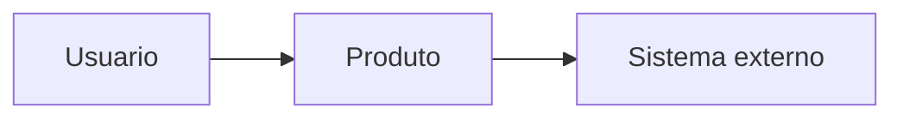

# Project Requirements Document — PRD

<!--
Modelo mestre de requisitos do produto antes do GitHub Spec Kit.
Use N/A - nao aplicavel, porque: <justificativa> quando uma secao nao se aplicar.
Nao remova secoes sem registrar por que elas nao se aplicam.
Nenhum agente pode marcar este documento como approved nem inventar aprovacao humana.
-->

## Instrucoes de uso

<!-- Explique como preencher, revisar e transformar recortes aprovados em specs do Spec Kit. -->

Este PRD e um modelo hibrido com elementos de Product Requirements Document, Software Requirements Specification, Engenharia de Requisitos e especificacao orientada a criterios verificaveis. Ele e a fonte mestre de requisitos do produto. O GitHub Spec Kit continua responsavel por transformar recortes aprovados em specification -> plan -> tasks -> implementation -> validation -> convergence.

Preencha o PRD antes de executar `specify`, `plan`, `tasks` ou `implement`. Use `TODO`, `ASSUMPTION` ou `QUESTION` para informacoes ausentes. Nao copie silenciosamente requisitos para specs; referencie os IDs canonicos deste documento.

Profundidade por perfil:

- Lite: problema, objetivo, escopo, nao objetivos, requisitos essenciais, criterios de aceitacao, riscos principais e questoes abertas.
- Standard: todas as secoes aplicaveis, requisitos atomicos, NFRs mensuraveis, rastreabilidade, riscos, estrategia de validacao e aprovacao humana antes da implementacao.
- Strict: Standard mais revisao formal, aprovadores registrados, seguranca, privacidade, matriz completa, evidencias, mudancas formais, requisitos legais e criterios de entrada e saida.

## Metadados e controle do documento

<!-- Mantenha o front matter atualizado. Estados permitidos: draft, in_review, approved, superseded. -->

Status atual: draft

## Historico de alteracoes

<!-- Registre data, autor humano ou papel, mudanca, motivo e impacto. -->

| Data | Versao | Autor | Mudanca | Impacto |
|---|---|---|---|---|
| TODO | 0.1.0 | TODO | Criacao inicial | TODO |

## Aprovacoes

<!-- Aprovacoes exigem pessoa, papel, data e decisao. Agentes nao preenchem aprovacao inexistente. -->

| Pessoa | Papel | Data | Decisao | Observacoes |
|---|---|---|---|---|
| TODO | TODO | TODO | TODO | TODO |

## Resumo executivo

<!-- Resuma produto, valor, usuarios, escopo e decisao esperada. -->

TODO

## Problema ou oportunidade

<!-- Descreva o problema real, oportunidade ou missao sem propor solucao prematura. -->

TODO

## Evidencias do problema

<!-- Use FACT para dados confirmados e ASSUMPTION para hipoteses. Inclua fonte e data. -->

- FACT: TODO
- ASSUMPTION: TODO

## Visao do produto

<!-- Descreva o estado futuro desejado e os limites do produto. -->

TODO

## Proposta de valor

<!-- Explique quem ganha valor, qual valor e como sera percebido. -->

TODO

## Objetivos

<!-- Objetivos devem ser mensuraveis ou verificaveis. -->

- SC-001: TODO

## Metricas e criterios de sucesso

<!-- Inclua metrica, unidade, baseline, alvo, janela de medicao e evidencia. -->

| ID | Metrica | Unidade | Baseline | Alvo | Metodo | Evidencia |
|---|---|---|---|---|---|---|
| SC-001 | TODO | TODO | TODO | TODO | TODO | TODO |

## Nao objetivos

<!-- Declare explicitamente o que o projeto nao tenta resolver. -->

TODO

## Itens fora de escopo

<!-- Liste itens excluidos para evitar ampliacao silenciosa de escopo. -->

TODO

## Stakeholders

<!-- Nao invente stakeholders. Use QUESTION quando faltarem nomes ou papeis. -->

| Stakeholder | Papel | Interesse | Fonte |
|---|---|---|---|
| QUESTION | TODO | TODO | TODO |

## Usuarios e personas

<!-- Personas devem vir de evidencia, entrevista ou decisao humana. -->

TODO

## Necessidades dos stakeholders

<!-- Rastreie necessidade -> requisito. Necessidades nao sao ainda solucoes tecnicas. -->

| ID | Stakeholder | Necessidade | Evidencia | Requisitos relacionados |
|---|---|---|---|---|
| NEED-001 | TODO | TODO | TODO | TODO |

## Responsabilidades e ownership

<!-- Declare responsaveis por requisito, decisao, operacao e aprovacao. -->

TODO

## Contexto e situacao atual

<!-- Descreva processos, sistemas, dor atual, restricoes e ambiente real. -->

TODO

## Sistemas e processos relacionados

<!-- Inclua sistemas externos, processos humanos, ferramentas e dependencias organizacionais. -->

TODO

## Escopo e fronteiras do produto

<!-- Defina o que esta dentro, fora e nas interfaces do sistema de interesse. -->

TODO

## Diagrama de contexto

<!-- Use Mermaid ou descricao textual. Mantenha atores, sistemas e fluxos claros. -->



## Glossario e linguagem do dominio

<!-- Defina termos ambigueis, siglas e linguagem usada pelos stakeholders. -->

| Termo | Definicao | Fonte |
|---|---|---|
| TODO | TODO | TODO |

## Premissas

<!-- ASSUMPTION deve permanecer visivel ate confirmacao ou remocao justificada. -->

- ASSUMPTION: TODO

## Dependencias

<!-- Declare dependencias tecnicas, humanas, legais, comerciais e operacionais. -->

TODO

## Restricoes

<!-- CONSTRAINT indica limite obrigatorio. Restricoes tecnicas precisam justificativa. -->

```yaml
id: CON-001
title: "TODO"
type: CON
statement: "O sistema deve TODO."
rationale: "TODO"
source: "TODO"
priority: must
status: proposed
acceptance_criteria:
  - id: AC-001
    statement: "Dado que TODO, quando TODO, entao TODO."
    verification_method: inspection
verification_method: inspection
dependencies: []
conflicts: []
related_items: []
owner: "TODO"
risk: "TODO"
```

## Jornadas dos usuarios

<!-- Descreva jornadas ponta a ponta, nao apenas telas ou endpoints. -->

TODO

## Casos de uso e cenarios

<!-- Inclua ator, objetivo, pre-condicoes, fluxo e resultado observavel. -->

TODO

## Fluxos principais

<!-- Liste o caminho nominal com passos observaveis. -->

TODO

## Fluxos alternativos

<!-- Cubra variacoes legitimas sem tratar erro como caminho principal. -->

TODO

## Fluxos de erro e recuperacao

<!-- Declare falhas esperadas, resposta do sistema e recuperacao. -->

TODO

## Regras de negocio

<!-- Regras de negocio devem vir de fonte humana, legal, operacional ou decisao aprovada. -->

```yaml
id: BR-001
title: "TODO"
type: BR
statement: "O sistema deve TODO."
rationale: "TODO"
source: "TODO"
priority: must
status: proposed
acceptance_criteria:
  - id: AC-002
    statement: "TODO"
    verification_method: inspection
verification_method: inspection
dependencies: []
conflicts: []
related_items: []
legal_or_policy_reference: "TODO"
evidence: "TODO"
```

## Requisitos funcionais

<!-- Cada requisito contem uma obrigacao principal, clara, viavel, verificavel e rastreavel. -->

Padroes de redacao equivalentes ao EARS:

- O sistema deve <comportamento observavel>.
- Quando <evento>, o sistema deve <resposta>.
- Enquanto <estado>, o sistema deve <comportamento>.
- Se <condicao indesejada>, o sistema deve <resposta>.
- Onde <recurso estiver habilitado>, o sistema deve <comportamento>.

```yaml
id: FR-001
title: "TODO"
type: FR
statement: "Quando TODO, o sistema deve TODO."
rationale: "TODO"
source: "TODO"
priority: must
status: proposed
acceptance_criteria:
  - id: AC-003
    statement: "Dado que <estado inicial>, quando <acao ou evento>, entao <resultado observavel>."
    verification_method: test
verification_method: test
dependencies: []
conflicts: []
related_items:
  - NEED-001
owner: "TODO"
risk: "TODO"
target_release: "TODO"
stability: "draft"
```

## Requisitos nao funcionais

<!-- Termos vagos exigem metrica, unidade, condicao, limiar, ambiente, metodo e evidencia. -->

Cubra quando aplicavel: desempenho e capacidade, disponibilidade, confiabilidade, resiliencia, seguranca, privacidade, usabilidade, acessibilidade, compatibilidade, interoperabilidade, manutenibilidade, testabilidade, modificabilidade, portabilidade, instalabilidade, observabilidade, operabilidade, escalabilidade, eficiencia de recursos, internacionalizacao e localizacao.

```yaml
id: NFR-001
title: "TODO"
type: NFR
statement: "Enquanto TODO, o sistema deve TODO."
rationale: "TODO"
source: "TODO"
priority: must
status: proposed
acceptance_criteria:
  - id: AC-004
    statement: "TODO"
    verification_method: analysis
verification_method: analysis
dependencies: []
conflicts: []
related_items: []
measurement_unit: "TODO"
threshold: "TODO"
evidence: "TODO"
```

## Modelo e requisitos de dados

<!-- Inclua entidades, propriedades, origem, retencao, qualidade e classificacao. -->

TODO

## Interfaces e integracoes

<!-- Declare atores, sistemas, protocolos, formatos, frequencia, erros e ownership. -->

TODO

## APIs, eventos e contratos externos

<!-- Contratos externos devem ser versionados, rastreaveis e testaveis. -->

TODO

## Seguranca

<!-- Nao invente ameaças ou controles; registre QUESTION onde analise faltar. -->

TODO

## Privacidade

<!-- Declare dados pessoais, finalidade, minimizacao, retencao e base legal quando aplicavel. -->

TODO

## Autorizacao e controle de acesso

<!-- Defina papeis, permissoes, negacoes, elevacao e auditoria esperada. -->

TODO

## Auditoria e rastreabilidade

<!-- Defina eventos auditaveis, retencao, integridade e acesso aos logs. -->

TODO

## Conformidade legal e regulatoria

<!-- Nao alegue conformidade sem verificacao formal. Registre referencias especificas. -->

TODO

## Acessibilidade

<!-- Declare padroes, usuarios afetados, criterios e metodo de verificacao. -->

TODO

## Observabilidade

<!-- Inclua logs, metricas, traces, alertas, dashboards e diagnostico. -->

TODO

## Operacao e suporte

<!-- Descreva suporte, SLAs se existirem, procedimentos e limites operacionais. -->

TODO

## Backup, recuperacao e continuidade

<!-- Defina RPO, RTO, testes de restauracao e responsabilidades quando aplicavel. -->

TODO

## Migracao e compatibilidade

<!-- Registre dados, usuarios, versoes, rollback, migracoes e compatibilidade. -->

TODO

## Ambientes e implantacao

<!-- Liste ambientes, promocao, configuracao, rollback e restricoes. -->

TODO

## Restricoes tecnologicas justificadas

<!-- Toda tecnologia obrigatoria precisa motivo, fonte, trade-off e alternativa considerada. -->

TODO

## Criterios globais de aceitacao

<!-- Criterios globais complementam, mas nao substituem criterios por requisito. -->

```gherkin
Dado que <estado inicial>
Quando <acao ou evento>
Entao <resultado observavel>
```

## Estrategia de verificacao e validacao

<!-- Diferencie verificacao contra requisitos de validacao em uso com stakeholders. -->

Metodos permitidos: inspection, analysis, demonstration, test.

## Riscos e mitigacoes

<!-- Inclua probabilidade, impacto, mitigacao, owner e gatilho de revisao. -->

TODO

## Alternativas consideradas

<!-- Separe alternativas de produto, processo e solucao tecnica. -->

TODO

## Decisoes que exigem ADR

<!-- Decisoes materiais viram MADR antes de serem consideradas aprovadas. -->

| ID | Decisao | Motivo | ADR |
|---|---|---|---|
| ADR-0001 | TODO | TODO | TODO |

## Releases e marcos

<!-- Marcos nao devem ser inventados por agentes; use QUESTION se faltarem datas. -->

TODO

## Matriz de rastreabilidade

<!-- Cadeia: necessidade -> requisito -> criterio -> Spec Kit spec -> tarefa -> codigo -> teste/benchmark -> evidencia. -->

| Necessidade | Requisito | Criterio | Spec Kit spec | Tarefa | Codigo | Teste/benchmark | Evidencia | Status |
|---|---|---|---|---|---|---|---|---|
| NEED-001 | FR-001 | AC-003 | TODO | T001 | TODO | TEST-001 | TODO | proposed |

## Questoes abertas

<!-- QUESTION representa pergunta que bloqueia qualidade, escopo ou aprovacao. -->

- QUESTION: TODO

## Decisoes pendentes

<!-- DECISION so aparece aqui quando ainda precisa aprovacao humana. -->

- TODO

## Waiting room ou requisitos futuros

<!-- Requisitos futuros ficam visiveis, priorizados e fora do escopo aprovado atual. -->

TODO

## Referencias e anexos

<!-- Cite fontes usadas. Nao copie textos protegidos; registre influencias em notices. -->

- ISO/IEC/IEEE 29148:2018, referencia conceitual para engenharia de requisitos.
- SEBoK, referencias conceituais para necessidades de stakeholders e requisitos de sistema.
- GitHub Spec Kit, fluxo SDD usado apos recortes aprovados deste PRD.
- EARS, referencia conceitual para padroes de redacao de requisitos.
- Volere e Mastering the Requirements Process, referencias conceituais para estrutura, necessidades, rastreabilidade e requisitos atomicos.
